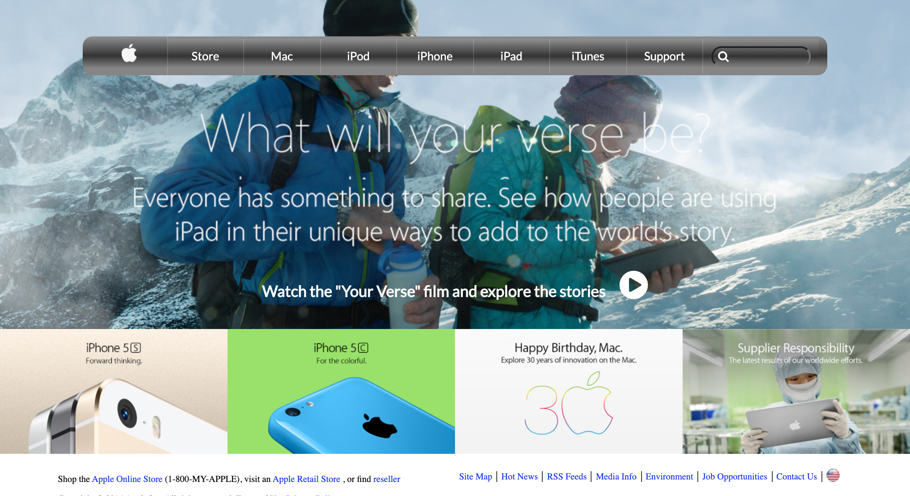

   

# Apple Clone

> HTML/CSS3 4th Project on Building with Backgrounds and Gradients.
> The project focuses on Best CSS practices by learning CSS layouts.

This project is a clone of the old Apple website with the features highlighted below:

- A navigation bar with a gradient background containing the logo, menu items and a search bar
- An hero image spanning the entire header section
- Two big titles showing with hyperlinks including a video link
- A product section created with flex
- A footer with links to other pages

## Built With

- HTML5
- CSS3

## Live Demo

[Apple clone](https://raw.githack.com/oracleot/apple-website-clone/develop/index.html)

## Authors

- 👤 [@oracleot](https://github.com/oracleot)

- 👤 [@IjayAbby](https://github.com/IjayAbby)

## 🤝 Contributing

Contributions, issues and feature requests are welcome!

Feel free to check the [issues page](https://github.com/oracleot/apple-website-clone/issues).

## 📝 License

This project is [MIT](lic.url) licensed.
